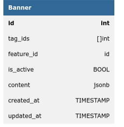
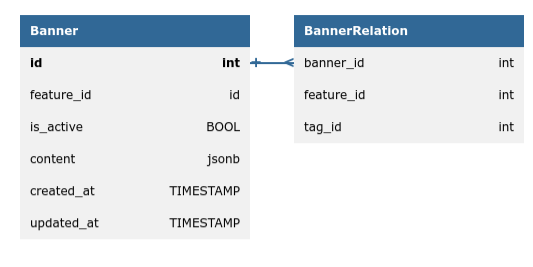
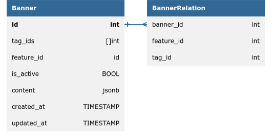

# Запуск сервиса
```
make run-app
```
Или
```
docker compose --env-file .env up --build
```

# Запуск интеграционных тестов
1. Запустить сервис
```
make test-app-up
```
2. Запустить тесты
```
make test-integr
```
3. Остановить сервис
```
make test-app-down
```

# Примеры использования
## Create Banner
```bash
curl -v -w "\n" \
-X POST  "http://localhost:9000/banner" \
-H "Content-Type: application/json" \
-H "token: admin_token" \
--data-binary @- << EOF
{
        "tag_ids": [1, 2, 3], 
        "feature_id": 1, 
        "is_active": true, 
        "content": {"title": "some_title", "text": "some_text", "url": "some_url"}
}
EOF
```

## UserBanner
```bash
curl -v -w "\n" "http://localhost:9000/user_banner?tag_id=2&feature_id=1" \
-H "token: user_token"
```

## Update Banner
```bash
curl -v -w "\n" \
-X PATCH  "http://localhost:9000/banner/1" \
-H "Content-Type: application/json" \
-H "token: admin_token" \
--data-binary @- << EOF
{
        "tag_ids": [1, 2], 
        "feature_id": 1, 
        "is_active": false, 
        "content": {"title": "new title", "text": "new text", "url": "new url"}
}
EOF
```

Выше я поставил is_active=false. Но пользователь всё равно сможет взять баннер в течении 5 минут, т.к. он лежит в кеше.
Чтобы получить обновленный:
```bash
curl -v -w "\n" "http://localhost:9000/user_banner?tag_id=2&feature_id=1&use_last_revision=true" \
-H "token:admin_token"
```

## Banner List
```bash
curl -v -w "\n" "http://localhost:9000/banner?tag_id=2" \
-H "token: admin_token"
```

## Delete Banner
```bash
curl -v -w "\n" \
-X DELETE "http://localhost:9000/banner/1" \
-H "token: admin_token"
```

# Вопросы и проблемы
## БД
Возник вопрос, нужно ли поддерживатьт ограничения на связи баннера с тегами и фичами. Я решил поддерживать. Изначально была одна таблица banner (схема ниже) и думал проверять при каждом запросе на создание.




Но тут много недостатков. Долгая проверка при вставке, при которой нужно перебрать все баннер и залезть в теги; в запросе user_banner будет долгий поиск по `tag_id` и `feature_id`.

Затем пришел к этому.




Тут в banner_relation добавлено ограничение `UNIQUE(feature_id, tag_id)`, что позволит быстро найти баннер в запросе user_banner.
Также индекс для banner_id, чтобы быстро собрать все теги для баннера.

Можно еще добавить дублирования, и тогда не нужно будет собирать теги для баннера. `banner_relation` остается для проверки ограничения и поиска баннера по `tag_id` и `feature_id`.



## Кеш
Я не знал, как лучше сделать обновление данных в кеше, поэтому поставил протухание в редис на 5 минут. Возможно, лучше было бы в приложении запускать каждые пять минут функцию, которая бы обовляла данные в кеше. Да и как то не успел.

